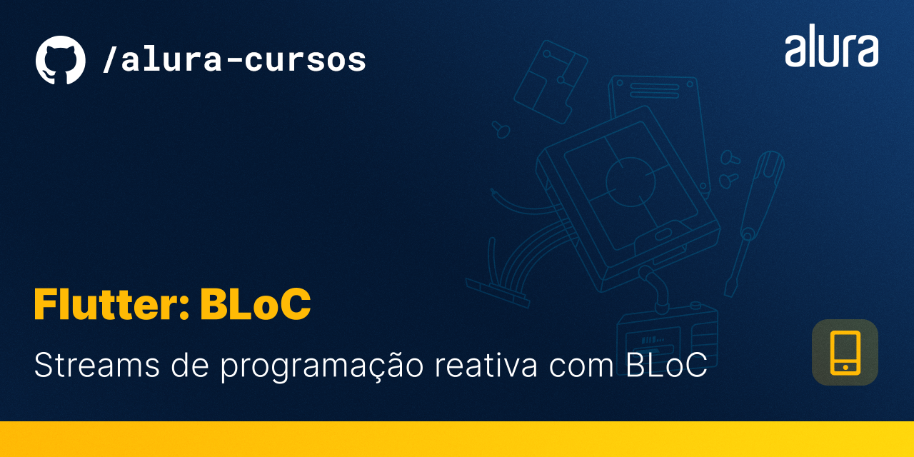

# Bytebank

O Bytebank App é a simulação do aplicativo de um banco, com ele você poderá fazer transações bancárias, informando o numero da conta e o valor monetário da transação!

## 🔨 Características do projeto

Neste curso avançado você aprenderá a usar o **Gerenciador de Estados BloC** para tornar o desenvolvimento da sua aplicação mais eficiente e escalável.


## ✔️ Técnicas e tecnologias

**Veja mais de perto o que você aprenderá sobre** :

- O que é e como usar `Blocs e Cubits`
- Como fazer o `Gerenciamento de Estado com BloC`
- Como usar um `Framework de Gerenciamento de Estado`
- Como `separar UI, Estado e Eventos`

## 📁 Acesso ao projeto

O acesso ao projeto está separado da seguinte forma:

```
├── aula-1
├── aula-2
├── aula-3
└── aula-4
```

A branch [aula-1](https://github.com/alura-cursos/flutter-bloc/tree/aula1) é o ponto de partida do repositório, é partindo dela que desenvolveremos a aula-1. Por sua vez, a aula-2 é uma continuação da aula-2 e assim vai sucessivamente. A branch aula-4 é a final, nela você encontra o código final criado no curso até a aula-4.

Você pode [baixar o zip](https://github.com/alura-cursos/flutter-bloc/archive/aula4.zip) com o código final do projeto ou [acessar o código fonte](https://github.com/alura-cursos/flutter-bloc/tree/aula4).

## 🛠️ Abrir e rodar o projeto

**Para executar este projeto você precisa:**

- Ter o [Flutter](https://flutter.dev/docs/get-started/install) instalado na sua máquina
- Ter algum editor de códigos ou IDE como o [Android Studio](https://developer.android.com/studio) ou [Intellij Idea](https://www.jetbrains.com/pt-br/idea/download/).

Caso opte por IDEs como as duas sugeridas acima, o processo de execução do aplicativo funcionará através de um botão de play na parte superior que ambas dispõem. Caso escolha rodar o projeto via linha de comandos, utilize o comando `flutter run`. Lembre-se de antes de executar o comando de navegar até a pasta do projeto antes.

Para mais instruções sobre a configuração do ambiente, recomendamos a leitura do artigo [Flutter - Como configurar o ambiente de desenvolvimento](https://www.alura.com.br/artigos/flutter-como-configurar-o-ambiente-de-desenvolvimento). Caso tenha desejo de obter conhecimento além dos cursos da [Formação Flutter](https://www.alura.com.br/formacao-flutter), recomendamos os livros [Iniciando com Flutter Framework](https://www.casadocodigo.com.br/products/livro-flutter) e [Aprofundando em Flutter](https://www.casadocodigo.com.br/products/livro-aprofundando-flutter) da editora [Casa do código](https://www.casadocodigo.com.br/).

## 📚 Mais informações do curso

Gostou do projeto e quer conhecer mais? Você pode [acessar o curso](https://cursos.alura.com.br/course/flutter-bloc) que desenvolve o projeto desde o começo!

Esse curso faz parte da [formação de Flutter da Alura](https://cursos.alura.com.br/formacao-android)
